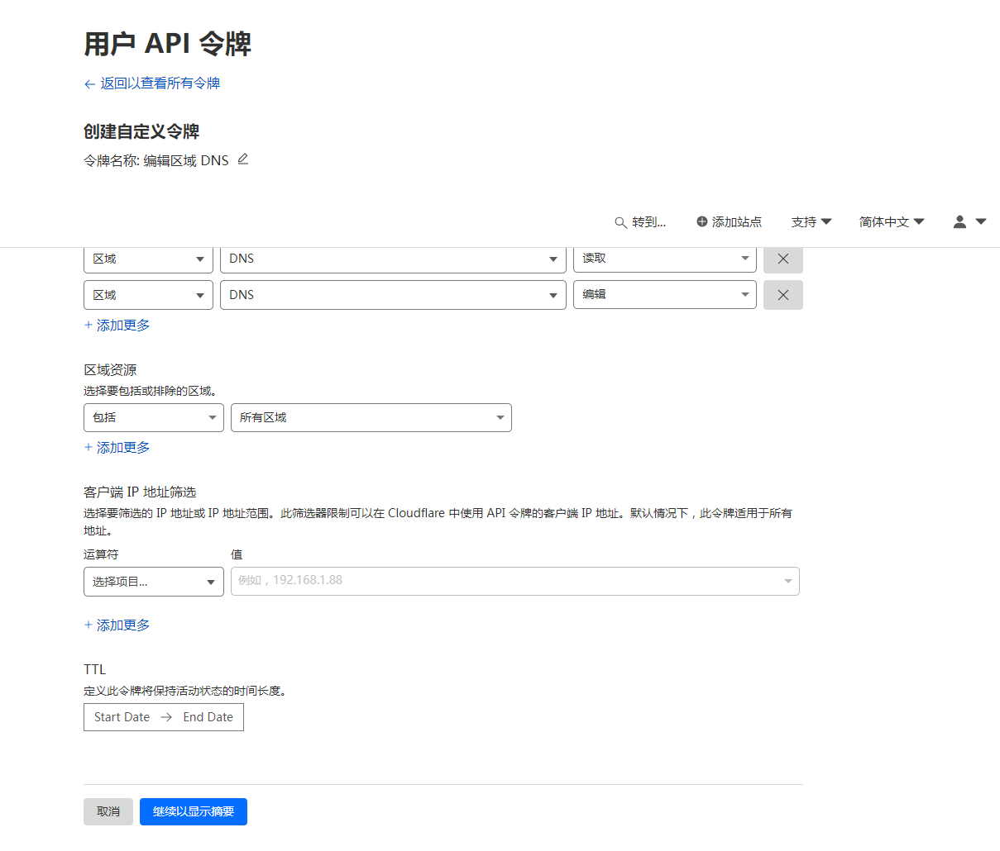
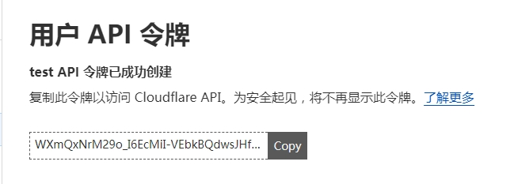
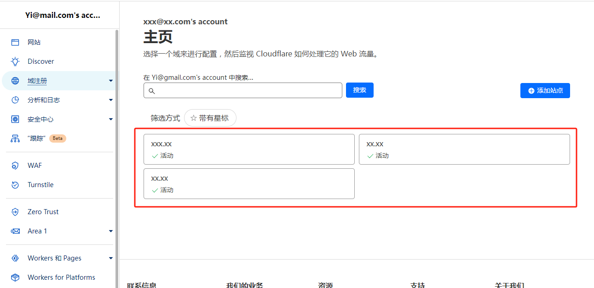
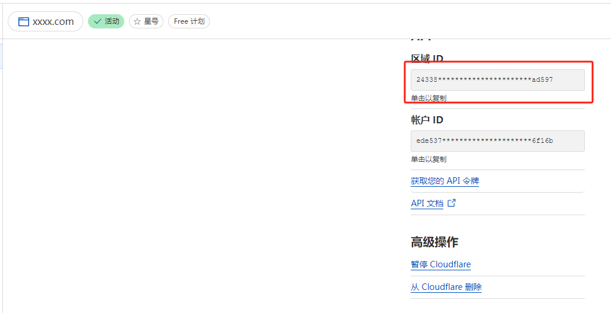
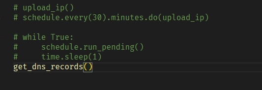
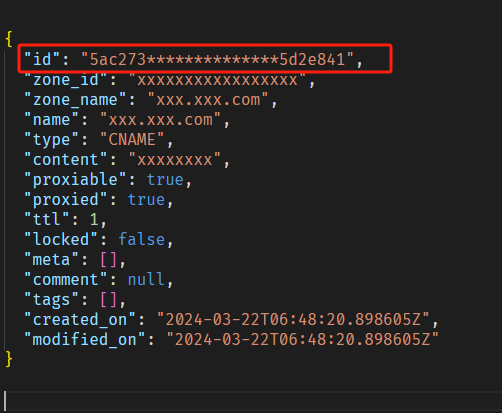

# Cloudflare DDNS 设置教程

> 本教程默认你已经注册了 Cloudflare，拥有了一个域名。 

## 项目地址  

[cloudflare-ddns](https://github.com/gofxas/cloudflare-ddns)

## 版本选择与工作原理

提供了 nodejs 版本脚本和 python 版本的脚本。工作原理就是设备访问 `https://ipify.org/`获取到本机 IP 地址 再更新到 DNS 记录。没有独立 IP 地址是没办法访问的。

## 依赖安装

工作之前需要安装依赖 参考 package.json 或者 requirements.txt 内的依赖进行安装。

## 准备工作

- 打开 `nodejs`或`python`文件夹，对应两个语言版本。找到 ddns.config 文件 。
- 需要先填写 token 和 zone_identifier 两个参数。

### 如何创建 token?

1. 登录进入控制台后 点击右上角头像出现下拉菜单。
2. 选择 `我的个人资料 （My Profile）`选项进入。
3. 进入之后选择左侧 `API令牌（API Tokens）` 进入。
4. 进入用户 API 令牌（User API Tokens）界面之后，找到创建令牌（create token）按钮并且点击进入。
5. 选择 Create Custom Token 并开始。
6. 进行如下配置 ，一定要给到编辑和读取资源的权限。区域选择要操作的域名或者账户。
   
7. 保存之后会展示一次 token 需要自己妥善保存。以后不会再展示了。
   

### 如何获取 zone_identifier 参数？

1. 主页选择需要获取的 zone 点击进入。
   
2. 滑到页面下方，注意看右侧会展示 zone_id，单击复制即可。
   

### 获取 recordid？

进入 ddns 的主程序（ddns.js 或者 ddns.py）。注释掉 `upload_ip()` 相关的调用代码 并启用 `getDnsRecords()`

准备完成之后 执行一次,控制台打印返回结果。找到要进行操作的 dns 记录，并复制出来 ID 这个 ID 就是需要的 recordid。  

## 执行代码

nodejs 可以使用 pm2 管理，linux 下可以把 pm2 添加到 系统守护进程开机自己启动。python 的如何添加守护进程还不会，可以告诉我一下。
