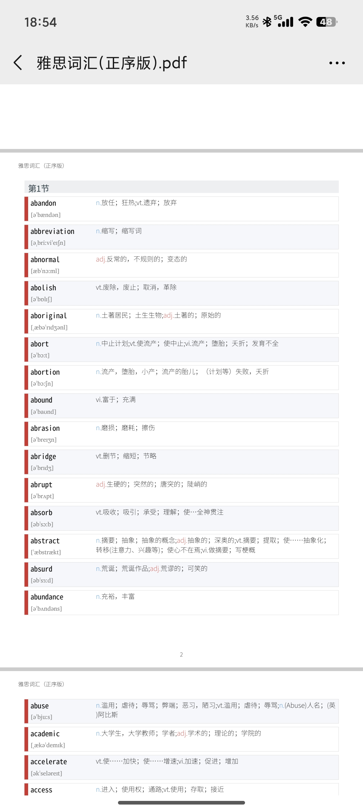
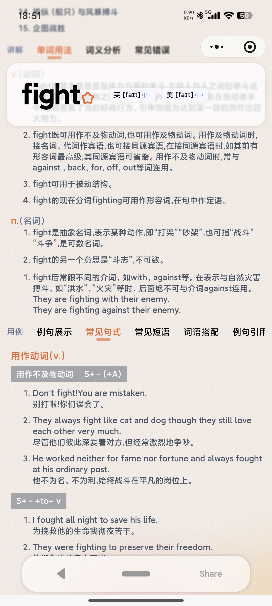

# 我为自己考雅思做了个单词小程序
## 介绍
找遍了全网，终于让我发现（其实是自己做的哈哈）一个可以一键生成单词本 PDF 的神仙工具了！
	
​对于习惯纸质背诵的人来说，导出打印简直是刚需。它很简陋，但很硬核：  
✅ 全库覆盖： 小学到大学、考研、雅思托福词库全都有。  
✅ 深度讲解： 每个单词都有详细拆解，不只是简单的翻译。  
✅ 拼写练习： 真正入脑入心的记忆，不是点点选选。  
✅ PDF 导出： 压轴功能！支持单词本一键导出 PDF 打印，方便纸笔党。  
	  
​作为一个技术老兵，我深知备考的不易。这个小程序不收费、不割韭菜，只希望能帮到正在奋斗的你。  
​🔍 微信搜索：[**麻辣单词**]    
    
赶紧冲！  
​#英语学习 #单词打卡 #PDF资源  #雅思备考  #托福词汇  #高效学习  #学习工具推荐    

### 首页  
  
### 学习模式选择与PDF导出  
- 支持学习模式和导出模式。
- 学习模式下，用户可以在小程序中学习单词，也可以选择默认单词本学习。  
- 导出模式下，用户可以一键导出单词本 PDF 打印。
- 导出的 PDF 文件大小在 10MB 以下，适合打印。
  
  

### 单词本选择  
- 支持自定义单词本，也可以选择默认单词本。
- 涵盖了小学到大学、考研、雅思托福词库全都有。  
  

### 学习界面  
- 包含单词、翻译、例句等功能。并且部分单词还有精选的视频例句，来源于影视作品片段。 
  

###  单词听写/拼写练习  
- 支持单词听写/拼写练习。
- 练习时，用户需要输入单词，小程序会判断用户输入是否正确。
- 错误或者忘记单词自动记录，进入错词本可以进行复习。
   

### 单词详解  
- 每个单词都有详细拆解，不只是简单的翻译。
- 单词拥有常用方法，词组搭配等。 
- 每个单词都有例句，帮助用户理解单词的使用场景。
- 更有单词相似词语，近义词反义词等。帮助用户扩展词汇词汇量。
  